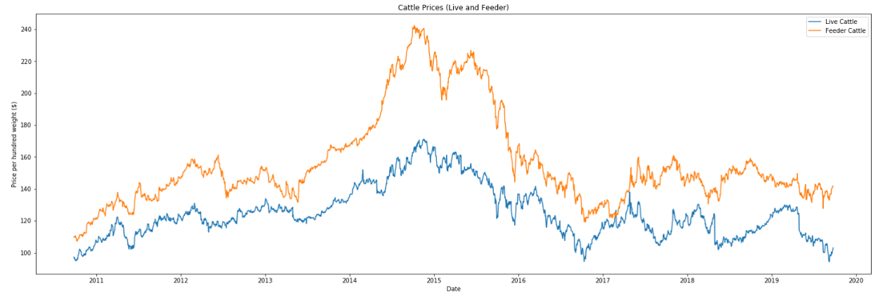
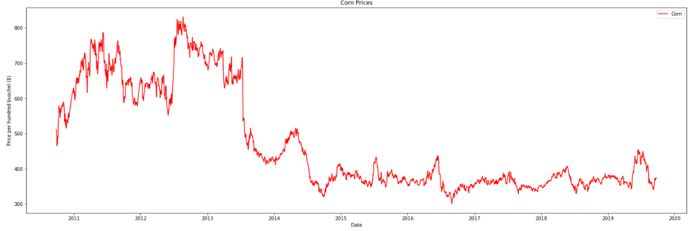
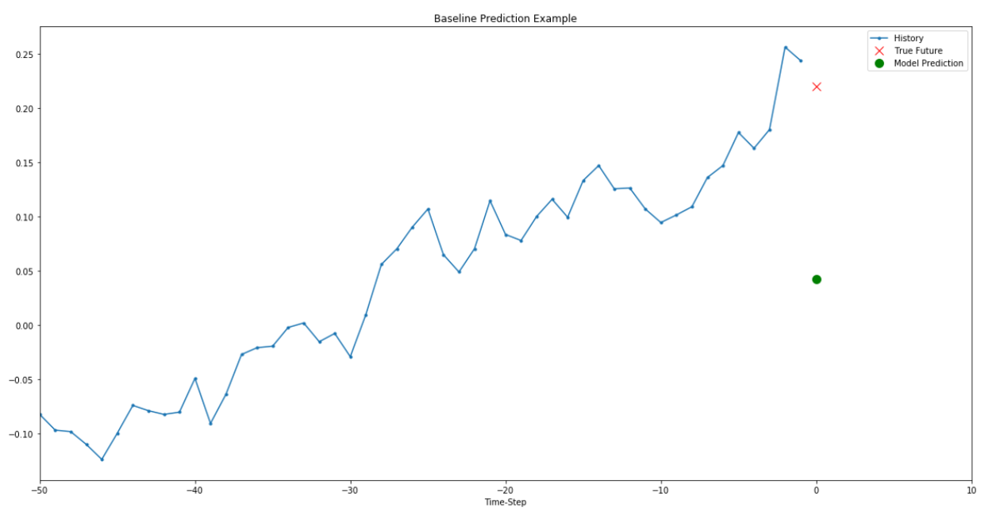
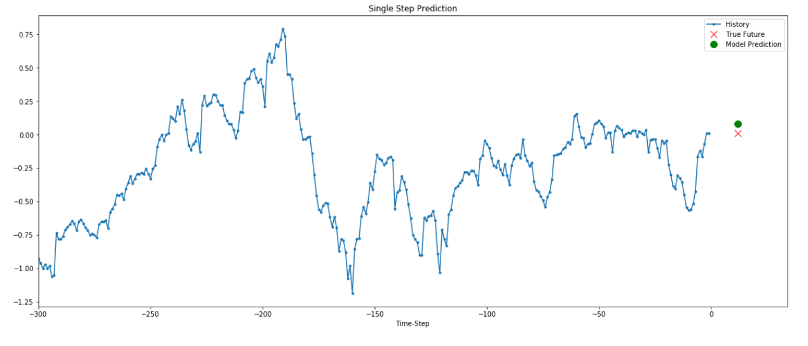

# Welcome to CattleTEC!

Helping you take control of your herd's tomorrow, today!

## Background
Goal is to use Data to Help Cow/Calf Producers Make Better Management Decisions to Increase Profitability

* Extremely volatile and uncertain markets for agricultural commodities
  * Unexpected weather
  * Global politics
* Many cow/calf producers today don’t have records of their operation
  * Time / Other priorities
  * Numerous variables making it difficult to be organized
* Factors on Profitability
  * Weather Patterns  :x:
  * Markets :x:
  * Input / Feed Costs  :white_check_mark:

## Data Analysis Task
An important feature of CattleTEC is being able to market forecast. The goal of this project is to bring in commodity values that matter to cow/calf producers and display them in a quick and easy to understand format that allows the user to refine and select out what timeframe of the markets they would like to explore. In addition, we are also developing a machine learning algorithm that will analyze the commodity trends from previous years in order to forecast out what the markets will do before they occur. This will  give farmers a competitive advantage when marketing their animals.

## Data Inputs
The Farmer can decide:
* Timeframe of the Market
* Commodities
* Point of Interest

## Project Workflow
Here you can see a brief layout of how we intend
to accomplish our project for ABE 516X this semester

## Results

## Topics Relevant to ABE 516X 
Incorporation of topics relevant to this class  - what from the class did you use in this project and why might it be useful for research projects like this?  What are the advantages and disadvantages?  Were there any assumptions or transformations needed?

## Automate and Reproduce Analysis
Ability to automate and reproduce your analysis (if the file input were to change, could this analysis be reproduced and how easily?)  - how will someone else reproduce this analysis?  Is the data stored somewhere?  Can I reproduce the figures easily?

## Assignment
Creation of one assignment based on your dataset for the class to complete - one can think of this of a task or homework assignment based on your project.

