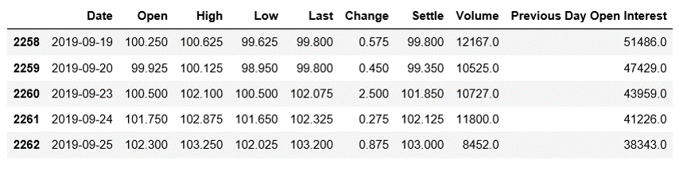
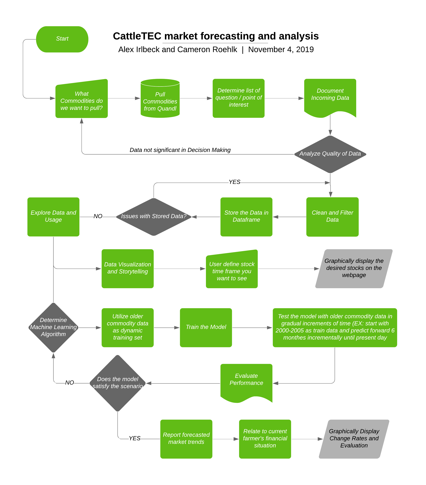
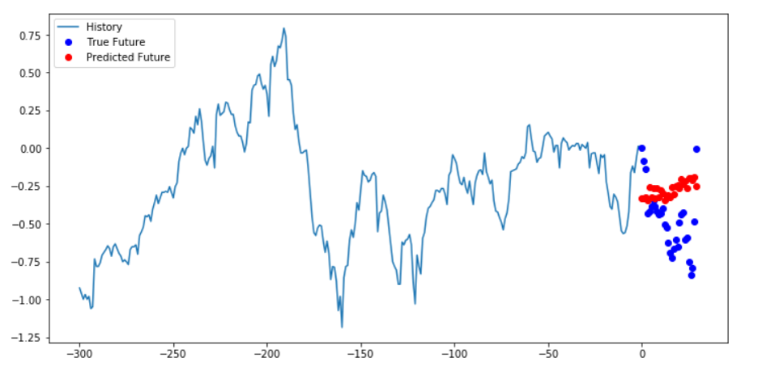

# Welcome to CattleTEC!

Helping you take control of your herd's tomorrow, today!

## Background
Challenges in the Cow/Calf Industry:
* Extremely volatile and uncertain markets for agricultural commodities
  * Unexpected weather
  * Politics
* Many cow/calf producers today don’t have records of their operation
  * Time / Other priorities
  * Numerous variables making it difficult to be organized
* Factors on Profitability
  * Environmental Patterns  :x: Can't control
  * Markets :x: Can't Control
  * Input / Feed Costs  :white_check_mark: Controllable
  
Our goal is to use data on input costs and market values to help cow/calf producers make better management decisions to increase their profitability.

## Data Analysis Task
An important feature of CattleTEC is being able to market forecast. The goal of this project is to bring in commodity values that matter to cow/calf producers and display them in a quick and easy to understand format that allows the user to refine and select out what timeframe of the markets they would like to explore. In addition, we are also developing a machine learning algorithm that will analyze the commodity trends from previous years in order to forecast out what the markets will do before they occur. This will  give farmers a competitive advantage when marketing their livestock.

## Data Inputs
The user has the power to select the market timeframe and what commodities they want to analyze. For our example, we brought in Quandl data on the CME for Corn, Live Cattle, and Feeder Cattle. This gave us information including opening price, closing price, highest daily price, lowest daily price, volume traded, and daily change for all three commodities. 

## Project Workflow
Here is the layout of how we intend to accomplish our project for the duration of ABE 516X.

## Results
First we started by pulling in cattle prices for both feeder and live cattle from September 2010 to September 2019 so we can gain a visual of the trend in cattle prices

We also brought in corn prices during that same time frame

#### Long-Short Term Memory
We used LSTM neural network training for our machine learning algorithm and started with our baseline prediction which essentially averaged the closing price of the last 50 days to predict the next day price.

#### Single Step Prediction
We then moved to a slightly more elaborate model which took into account all of the data we were giving it and attempted to predict one point a set amount of days later. For this example we took 300 days worth of data and attempted to go 30 days forward. The results are seen below.

#### Multi Step Prediction
Finally we wanted to try to predict every day to see how well our trends matched. So we again used all of the data for the last 300 days but tried to predict each of the next 30 days. This was a disappointing result as you can see below as it didn't appear to correlate well at all.

#### Conclusion
Due to our limited knowledge of deep machine learning and LSTM, we are unclear on the accuracy of these results at this time. Going forward we are going to continue to investigate how changing parameters will influence the model. In addition, this was right on the verge of our hardware capabilities. An AWS workspace may be necessary to continue to increase the accuracy of our model. Additional factors that we are looking to add into this predictive algorithm include weather patterns in the midwest, other commodities, and key stock values which may provide indications of market direction.

## Topics Relevant to ABE 516X 
* Importing, handling, and storing data
* Merging, manipulating and cleaning (removing nulls, etc) from databases
* Setting up training and testing datasets for us in machine learning
* Finding and breaking down documentation in order to implement machine learning. LSTM was not discussed in class but this allowed us to work with it
* Evaluating model perforamance

## Automate and Reproduce Analysis
Quandl allows for a similar exercise to be done very easily. You simply need to change your API key to bring in a different dataset. While the variable names are set up for cattle to make it easier for us this would be the only confusing part of changing to different commodities or stocks. The LSTM models themselves are pretty resilient to any changes to the dataset. As long as you provide a long enough dataset then you shouldn't have to change anything and worse case you would have to change the lengths of different analysis. All in all, this is a very repeatible program that really doesn't change for any type of stock or commodity datasets that you would choose to feed it.

## Assignment
Pull in three stock or commodity datasets from the Quandl API of your choosing and process them down to remove any null or strange values. Then graphically display them and comment on any trends that you think may tie between the three sets. Finally merge them down to one dataset of the most important variable from each so that it can easily be used for future machine learning analysis.

